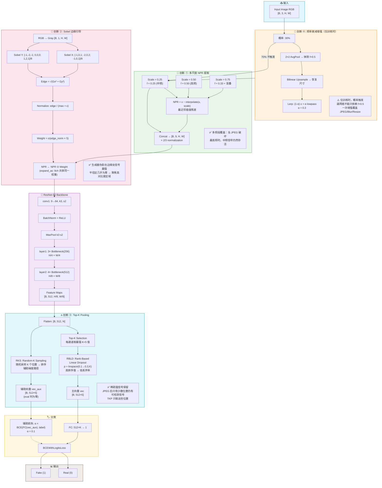
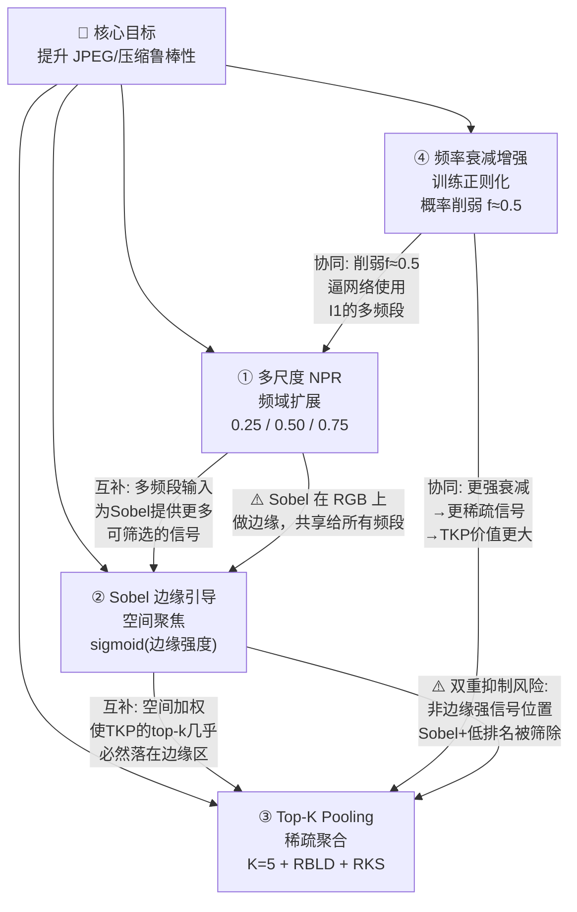

# NPR 深度伪造检测优化 — 流程图

## 图1: 整体架构流程（训练 + 推理）

---

## 图2: 数据流与维度变化

```mermaid
flowchart LR
    subgraph S1["阶段1: 输入"]
        A["[B, 3, H, W]<br/>RGB Image"]
    end

    subgraph S2["阶段2: 多尺度NPR"]
        B["[B, 9, H, W]<br/>3 scales × 3 RGB<br/>Multi-band residuals"]
    end

    subgraph S3["阶段3: 边缘引导"]
        C["[B, 9, H, W]<br/>× sigmoid(edge)<br/>Spatially weighted"]
    end

    subgraph S4["阶段4: 下采样"]
        D1["[B, 64, H/2, W/2]<br/>conv1 + maxpool"]
        D2["[B, 256, H/4, W/4]<br/>layer1"]
        D3["[B, 512, H/8, W/8]<br/>layer2"]
    end

    subgraph S5["阶段5: 池化"]
        E["[B, 512×K]<br/>Top-K per channel<br/>Sparse aggregation"]
    end

    subgraph S6["阶段6: 输出"]
        F["[B, 1]<br/>Real / Fake"]
    end

    A -->|"创新①"| B
    B -->|"创新②"| C
    C -->|"ResNet"| D1
    D1 --> D2
    D2 --> D3
    D3 -->|"创新③"| E
    E -->|"FC"| F

    style S2 fill:#e8f5e9,stroke:#388e3c
    style S3 fill:#fce4ec,stroke:#c62828
    style S5 fill:#e0f7fa,stroke:#00838f
```

---

## 图3: 四项创新间的协同关系

---

## 创新点定位总结

| 创新 | 管线位置 | 作用维度 | 对抗退化 |
|------|---------|---------|---------|
| ① 多尺度 NPR | 输入预处理 | **频率维度** | JPEG 高频压制 |
| ② Sobel 边缘引导 | 特征加权 | **空间维度** | 平坦区噪声 |
| ③ Top-K Pooling | 聚合策略 | **聚合维度** | 信号稀释 |
| ④ 频率衰减增强 | 训练增强 | **数据维度** | 过拟合 f=0.5 |
